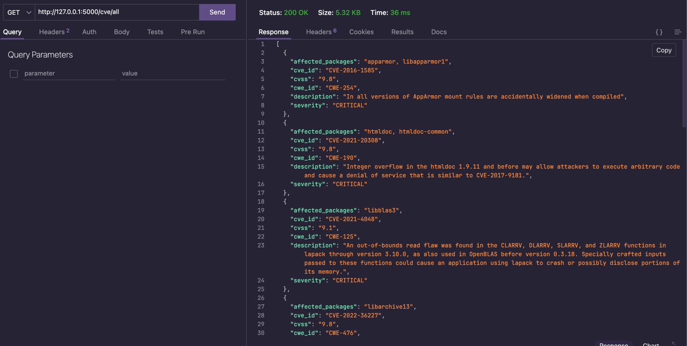
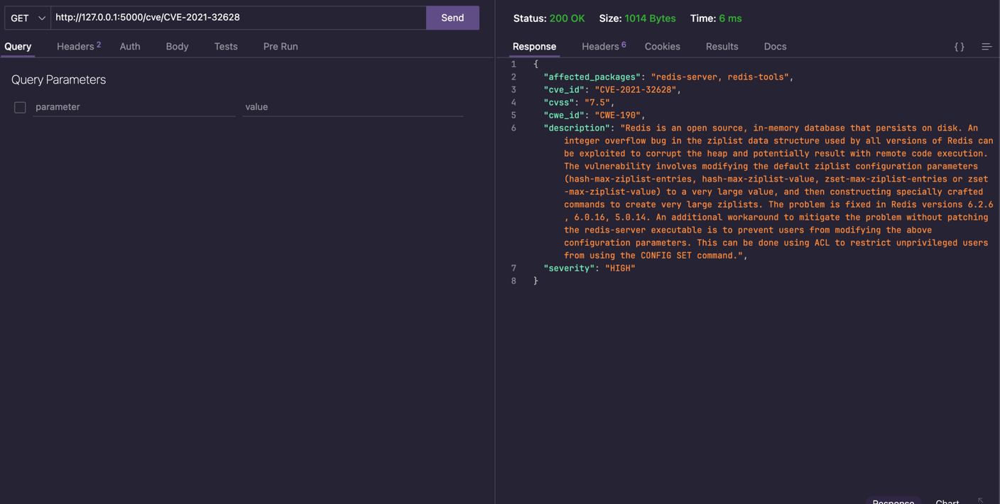
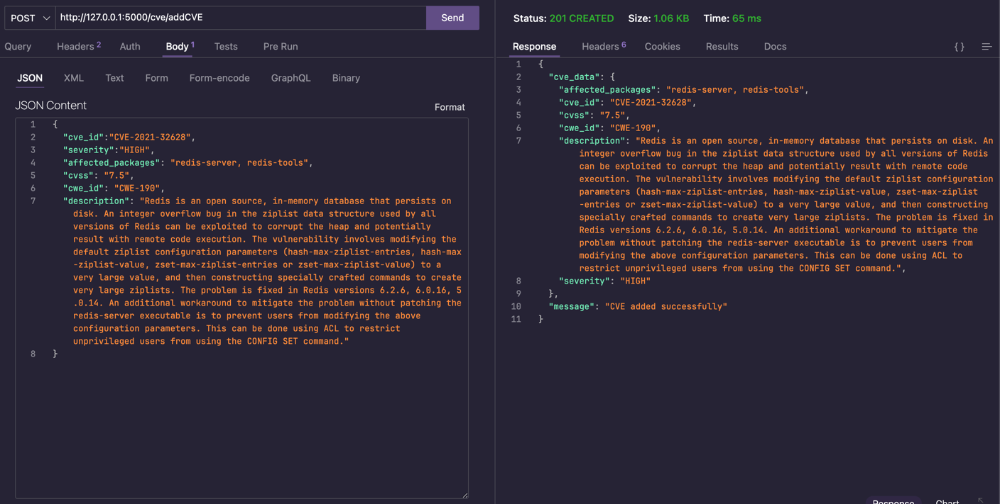
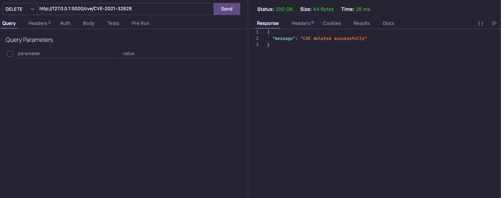
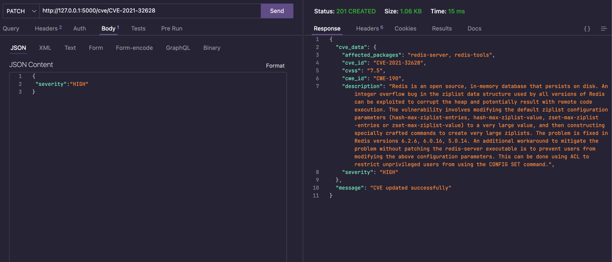

# SecOps Solution - Backend Engineering Internship Test

---

## Pre-Requisites
1. Install Latest python
    - Install latest version of python from below link: https://www.python.org/downloads/release/python-3122/
2. Install the sqlite db
   - in macOS use the command
     - > `brew install sqlite3`
   - in unix debian based systems use the below command
     - > `sudo apt install sqlit3`
   - In Windows systems use the below link to download and install sqlite
     - https://www.sqlite.org/download.html
3. Install git in your system
   - download and install git for windows/unix/macOS from the link https://git-scm.com/downloads

---

## Steps to run the Flask Application
1. Clone the GitHub Repository
    - Clone the GitHub repository using the below command
      - > `git clone https://github.com/eswarmaganti/SecOps-project.git`
2. Navigate to root directory of project
   - > `cd cve-flask-rest-api`
3. In project root directory run the below command to set up the python virtual environment
   - > `python3 -m venv venv`
4. Install the python dependencies using following command
   - > `pip install requirements.txt`
5. To import the data into sqlite db from csv file
   - copy the python code in filename **import_data.py** in **src** directory
   - open the terminal in project root directory
   - paste the code in terminal and hit enter to initialize the db and to import the data from csv file to sqlite DB
   - exit from flask shell using exit() command
6. Run the below command to start the Flask server
   - > `flask run`
   - You can find the url of your flask application running in your machine in terminal
   - example: http://127.0.0.1:5000

7. Open any REST API testing tools like **Thunder Client** for VSCode or **Postman** to test the API Endpoints
   - Get all available cve's 
     - 
   - Get a cve by ID
     - 
   - Add new cve
     - 
   - Delete a cve
     - 
   - Update existing cve
     - 

---
- Author: *Eswar Krishna Maganti*
- Email: *maganti.ek@gmail.com*
- LinkedIn: https://www.linkedin.com/in/eswar-krishna-maganti/
- Github: https://github.com/eswarmaganti/